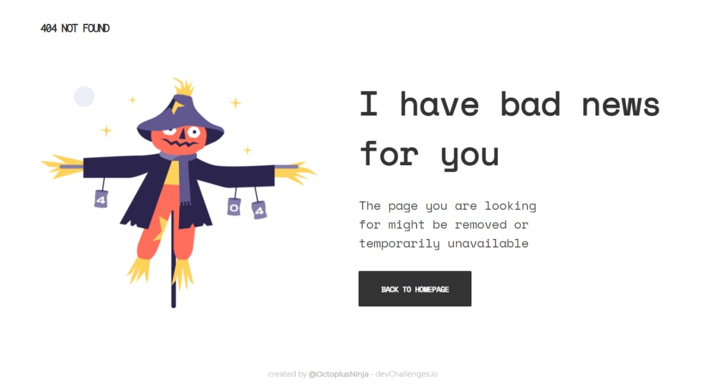

<!-- Please update value in the {}  -->

<h1 align="center">404 NOT FOUND</h1>

   Solution for a challenge from  <a href="http://devchallenges.io" target="_blank">Devchallenges.io</a>.

  <h3>
    <a href="https://404-not-found-octoplus.netlify.app/">
      Demo
    </a>
     | 
    <a href="https://github.com/OctoplusNinja/404-Not-Found-Challenge">
      Solution
    </a>
     | 
    <a href="https://devchallenges.io/challenges/wBunSb7FPrIepJZAg0sY">
      Challenge
    </a>
  </h3>

<!-- TABLE OF CONTENTS -->

## Table of Contents

- [Overview](#overview)
  - [Built With](#built-with)
- [Features](#features)
- [Contact](#contact)

<!-- OVERVIEW -->

## Overview

  

  <h3 align="center">Desktop</h3>
  

  

  

  <h3 align="center">Mobile</h3>
  

  
  

### Built With

<!-- This section should list any major frameworks that you built your project using. Here are a few examples.-->

- HTML 5
- CSS 3 (GRID System)
- JavaScript (For Parallax effect)
- Netlify

## Features

<!-- List the features of your application or follow the template. Don't share the figma file here :) -->

This application/site was created as a submission to a [DevChallenges](https://devchallenges.io/challenges) challenge. The [challenge](https://devchallenges.io/challenges/wBunSb7FPrIepJZAg0sY) was to build an application to complete the given user stories.

## Contact

- GitHub [@OctoplusNinja](https://github.com/OctoplusNinja)
- Twitter [@AniruddhaDas852](https://twitter.com/AniruddhaDas852)
